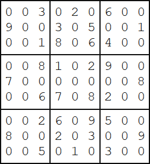
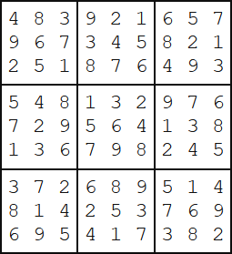

# SuDoku

SuDoku (Japanese meaning number place) is the name given to a popular puzzle concept. The objective of SuDoku puzzles is to replace the blanks (or zeros) in a 9 by 9 grid in such that each row, column, and 3 by 3 box contains each of the digits 1 to 9. Below is an example of a typical starting puzzle grid and its solution grid.

 

A well constructed SuDoku puzzle has a unique solution and can be solved by logic, although it may be necessary to employ "guess and test" methods in order to eliminate options (there is much contested opinion over this). The complexity of the search determines the difficulty of the puzzle; the example above is considered easy because it can be solved by straight forward direct deduction.

The file [sudoku.txt](./data/sudoku.txt) contains fifty different SuDoku puzzles ranging in difficulty, but all with unique solutions (the first puzzle in the file is the example above).

Solve as many of the fifty puzzles as you can!
